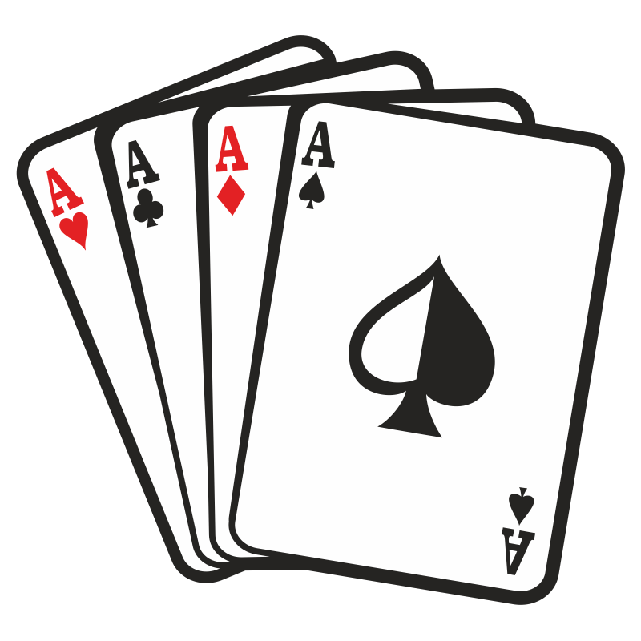

<!-- PROJECT SHIELDS -->
<!--
*** I'm using markdown "reference style" links for readability.
*** Reference links are enclosed in brackets [ ] instead of parentheses ( ).
*** See the bottom of this document for the declaration of the reference variables
*** for contributors-url, forks-url, etc. This is an optional, concise syntax you may use.
*** https://www.markdownguide.org/basic-syntax/#reference-style-links
-->

[//]: # ([![Contributors][contributors-shield]][contributors-url])

[//]: # ([![Forks][forks-shield]][forks-url])

[//]: # ([![Stargazers][stars-shield]][stars-url])

[//]: # ([![Issues][issues-shield]][issues-url])

[//]: # ([![MIT License][license-shield]][license-url])

[//]: # ([![LinkedIn][linkedin-shield]][linkedin-url])
[](https://github.com/pns-si3-projects/dojo-poker-22-23-ps5-22-23-poker-f/actions/workflows/github-actions-maven-test-build.yml)


<!-- PROJECT LOGO -->
<br />
<div align="center">
  <a href="https://github.com/pns-si3-projects/dojo-poker-22-23-ps5-22-23-poker-f">
    

  </a>

<h3 align="center">Dojo Pokerhand</h3>

  <p align="center">
    Compare two poker hands entered on the standard input, determine which is more
strong and display this result.
    <br />
    <a href="https://github.com/pns-si3-projects/dojo-poker-22-23-ps5-22-23-poker-f"><strong>Explore the docs »</strong></a>
    <br />
    <br />
    <a href="https://github.com/pns-si3-projects/dojo-poker-22-23-ps5-22-23-poker-f">View Demo</a>
    ·
    <a href="https://github.com/pns-si3-projects/dojo-poker-22-23-ps5-22-23-poker-f/issues">Report Bug</a>
    ·
    <a href="https://github.com/pns-si3-projects/dojo-poker-22-23-ps5-22-23-poker-f/issues">Request Feature</a>
  </p>
</div>


[//]: # (<!-- TABLE OF CONTENTS -->)

[//]: # (<details>)

[//]: # (  <summary>Table of Contents</summary>)

[//]: # (  <ol>)

[//]: # (    <li>)

[//]: # (      <a href="#about-the-project">About The Project</a>)

[//]: # (      <ul>)

[//]: # (        <li><a href="#built-with">Built With</a></li>)

[//]: # (      </ul>)

[//]: # (    </li>)

[//]: # (    <li>)

[//]: # (      <a href="#getting-started">Getting Started</a>)

[//]: # (      <ul>)

[//]: # (        <li><a href="#prerequisites">Prerequisites</a></li>)

[//]: # (        <li><a href="#installation">Installation</a></li>)

[//]: # (      </ul>)

[//]: # (    </li>)

[//]: # (    <li><a href="#usage">Usage</a></li>)

[//]: # (    <li><a href="#contributing">Contributing</a></li>)

[//]: # (    <li><a href="#license">License</a></li>)

[//]: # (  </ol>)

[//]: # (</details>)


<!-- ABOUT THE PROJECT -->

## Game Rules

A poker hand consists of 5 cards drawn from a single deck of 52 cards.

Each card has a color, Clubs, Diamonds, Hearts, Spades (denoted Tr, Ca, Co, Pi) and one of 2, 3, 4, 5, 6, 7, 8, 9, 10,
jack, queen, king, ace (denoted 2, 3, 4, 5, 6, 7, 8, 9, 10, J, Q, R, A).

For the calculation of the score, all the colors have the same level,
for example the ace of diamonds is not beaten by the ace of spades, they are
equal. The values are ordered as defined previously, the 2 being the smallest value
and ace the biggest


<p align="right">(<a href="#readme-top">back to top</a>)</p>


## Current features

* Compare two poker hands
* Calculate the winner
* Display the winning hand and how it was won
* Validate inputs
* Play again

<p align="right">(<a href="#readme-top">back to top</a>)</p>

### Built With

* [Java](https://www.java.com/fr/)
* [Maven](https://maven.apache.org/)
* [JUnit](https://junit.org/junit5/)

<p align="right">(<a href="#readme-top">back to top</a>)</p>


<!-- GETTING STARTED -->

## Getting Started

### Prerequisites

* Maven
* Java 17
* Git

### Installation

1. Clone the repo
   ```sh
   git clone https://github.com/pns-si3-projects/dojo-poker-22-23-ps5-22-23-poker-f
   ```
2. Build the project
   ```sh
   mvn clean install
   ```
3. Run the project
   ```sh
   mvn exec:java
   ```

<p align="right">(<a href="#readme-top">back to top</a>)</p>

### Run tests

1. Run tests
   ```sh
   mvn test
   ```
2. Generate reports
   ```sh
   mvn site
   ```

<p align="right">(<a href="#readme-top">back to top</a>)</p>

<!-- USAGE EXAMPLES -->

## Usage

* Enter the two hands to compare
* The program will display the winner

```sh
Welcome to the Poker Hand Game!
Enter hand 1:
4Co 4Pi 7Ca 2Co 5Tr
Enter hand 2:
5Co 5Ca 4Ca 4Tr 6Ca
The winner is Player 2
[5♥, 5♦, 4♦, 4♣, 6♦]
With a Two Pair
Do you want to play again?
1 - Yes
2 - No
Enter your choice:
2
Thanks for playing!

```

<p align="right">(<a href="#readme-top">back to top</a>)</p>


[//]: # ()

[//]: # (<!-- ROADMAP -->)

[//]: # ()

[//]: # (## Roadmap)

[//]: # ()

[//]: # (- [ ] Feature 1)

[//]: # (- [ ] Feature 2)

[//]: # (- [ ] Feature 3)

[//]: # (    - [ ] Nested Feature)

[//]: # ()

[//]: # (See the [open issues]&#40;https://github.com/pns-si3-projects/dojo-poker-22-23-ps5-22-23-poker-f/issues&#41; for a full list of)

[//]: # (proposed features &#40;and)

[//]: # (known issues&#41;.)

[//]: # ()

[//]: # (<p align="right">&#40;<a href="#readme-top">back to top</a>&#41;</p>)

[//]: # ()


[//]: # (<!-- CONTRIBUTING -->)

[//]: # ()

[//]: # (## Contributing)

[//]: # ()

[//]: # (Contributions are what make the open source community such an amazing place to learn, inspire, and create. Any)

[//]: # (contributions you make are **greatly appreciated**.)

[//]: # ()

[//]: # (If you have a suggestion that would make this better, please fork the repo and create a pull request. You can also)

[//]: # (simply open an issue with the tag "enhancement".)

[//]: # (Don't forget to give the project a star! Thanks again!)

[//]: # ()

[//]: # (1. Fork the Project)

[//]: # (2. Create your Feature Branch &#40;`git checkout -b feature/AmazingFeature`&#41;)

[//]: # (3. Commit your Changes &#40;`git commit -m 'Add some AmazingFeature'`&#41;)

[//]: # (4. Push to the Branch &#40;`git push origin feature/AmazingFeature`&#41;)

[//]: # (5. Open a Pull Request)

[//]: # ()

[//]: # (<p align="right">&#40;<a href="#readme-top">back to top</a>&#41;</p>)

[//]: # ()


<!-- LICENSE -->

## License

Distributed under the Mozilla Public License Version 2.0. See `LICENSE` for more information.

<p align="right">(<a href="#readme-top">back to top</a>)</p>


<!-- CONTACT -->

[//]: # (## Contact)

[//]: # ()

[//]: # (Your Name - [@twitter_handle]&#40;https://twitter.com/twitter_handle&#41; - email@email_client.com)

[//]: # ()

[//]: # (Project)

[//]: # (Link: [https://github.com/pns-si3-projects/dojo-poker-22-23-ps5-22-23-poker-f]&#40;https://github.com/pns-si3-projects/dojo-poker-22-23-ps5-22-23-poker-f&#41;)

[//]: # ()

[//]: # (<p align="right">&#40;<a href="#readme-top">back to top</a>&#41;</p>)

[//]: # ()

[//]: # ()

[//]: # ()

[//]: # (<!-- ACKNOWLEDGMENTS -->)

[//]: # ()

[//]: # (## Acknowledgments)

[//]: # ()

[//]: # (* []&#40;&#41;)

[//]: # (* []&#40;&#41;)

[//]: # (* []&#40;&#41;)

[//]: # ()

[//]: # (<p align="right">&#40;<a href="#readme-top">back to top</a>&#41;</p>)

[//]: # ()


<!-- MARKDOWN LINKS & IMAGES -->
<!-- https://www.markdownguide.org/basic-syntax/#reference-style-links -->

[contributors-shield]: https://img.shields.io/github/contributors/pns-si3-projects/dojo-poker-22-23-ps5-22-23-poker-f.svg?style=for-the-badge

[contributors-url]: https://github.com/pns-si3-projects/dojo-poker-22-23-ps5-22-23-poker-f/graphs/contributors

[forks-shield]: https://img.shields.io/github/forks/pns-si3-projects/dojo-poker-22-23-ps5-22-23-poker-f.svg?style=for-the-badge

[forks-url]: https://github.com/pns-si3-projects/dojo-poker-22-23-ps5-22-23-poker-f/network/members

[stars-shield]: https://img.shields.io/github/stars/pns-si3-projects/dojo-poker-22-23-ps5-22-23-poker-f.svg?style=for-the-badge

[stars-url]: https://github.com/pns-si3-projects/dojo-poker-22-23-ps5-22-23-poker-f/stargazers

[issues-shield]: https://img.shields.io/github/issues/pns-si3-projects/dojo-poker-22-23-ps5-22-23-poker-f.svg?style=for-the-badge

[issues-url]: https://github.com/pns-si3-projects/dojo-poker-22-23-ps5-22-23-poker-f/issues

[license-shield]: https://img.shields.io/github/license/pns-si3-projects/dojo-poker-22-23-ps5-22-23-poker-f.svg?style=for-the-badge

[license-url]: https://github.com/pns-si3-projects/dojo-poker-22-23-ps5-22-23-poker-f/blob/master/LICENSE.txt

[linkedin-shield]: https://img.shields.io/badge/-LinkedIn-black.svg?style=for-the-badge&logo=linkedin&colorB=555

[linkedin-url]: https://linkedin.com/in/linkedin_username
